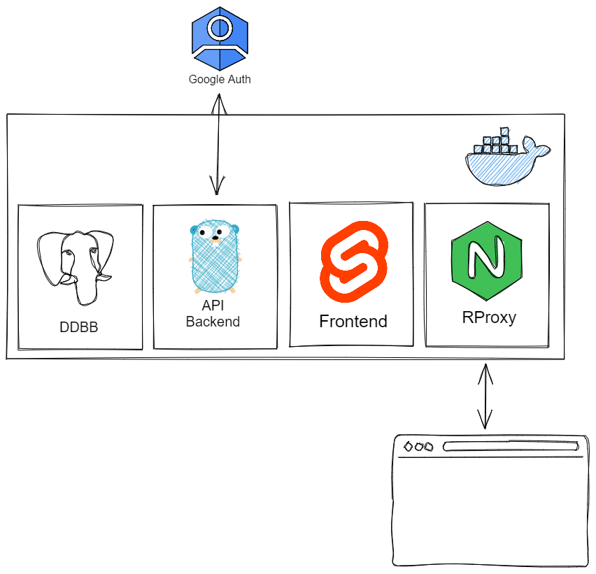

# ciber-canyas

Stupid project for counting canyes, just for fun. CIFP Francesc de Borja Moll internal meme.

# Development set up 

## Requirements

+ docker && docker-compose installed

## Commands

**Start dev compose**

```bash
mv .env.example .env
mv dev.docker-compose.yml docker-compose.yml 
docker-compose up -d && docker-compose logs -f
```

**When new go packages or npm modules are needed/added to package.json or go.mod**

```
docker-compose down (frontend || backend) && docker-compose up -d (frontend || backend)
```

## Architecture

